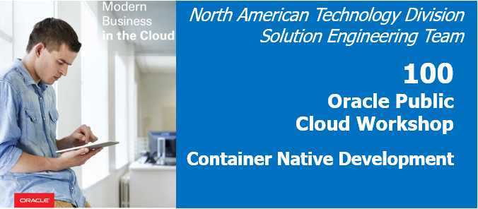
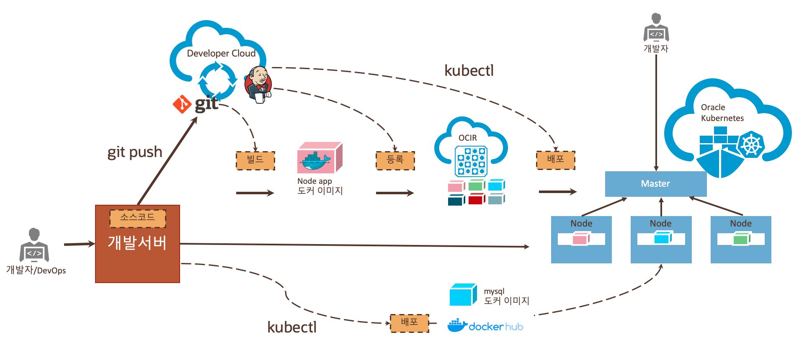

# CI/CD with Oracle Kubernetes Hands-On
 (Oracle Modern Cloud Day 2019의 Tech Hands-on Track)

 
## Introduction
본 핸즈온 문서는 Oracle Developer Cloud Service를 사용하여 간단한 샘플 Application을 Oracle Kubernetes Engine에 배포하고 CI/CD 기능을 활용해 자동으로 빌드하고 배포하는 과정을 다루고 있습니다. 본 과정을 통해서 기본적인 오라클 Devleloper Cloud의 CI/CD 기능과 Oracle Kubernetes의 기능들을 경험을 해볼 수 있습니다.

## Objectives
* Oracle Cloud Kubernetes Engine의 이해
*

## Required Artifacts
* 인터넷 접속 가능한 랩탑
* OCI (Oracle Cloud Infrastructure) 계정
* SSH Terminal (windows Putty, macOS Terminal 등)

## Client 접속 환경
ssh -i id_rsa 사용자명@132.145.83.122
실습 개발 환경 접속 정보 받기

## Oracle Developer Cloud Service와 Oracle Kubernetes Engine
### Developer Cloud
설명
### Oracle Kubernetes Engine
설명 

## 실습을 위한 클라이언트 환경
다음 주소를 클릭합니다. 본인의 이메일 주소를 입력하면 실습을 위한 클라이언트 환경을 할당받을 수 있습니다.
--- 여기서 이메일 입력, 제출 클릭하면 Private/Public Key (Putty, OpenSSH), IP, 접속 계정을 전달 받는다.

## 시나리오

## Hands-On 순서

1. [OCI(Oracle Cloud Infrastructure) 환경 확인하기](./1.oci.md)
2. [Kubernetes Cluster 환경에 접속하기](./2.oke.md)
3. [Developer Cloud Service 에 접속하기](./3.devcs.md)
4. [Developer Cloud Service 에서 Build 생성하기](./4.cicd.md)
5. [Application 확인하기](./5.app.md)]
   
***
