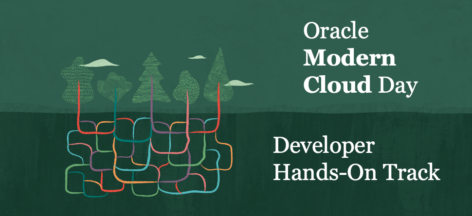
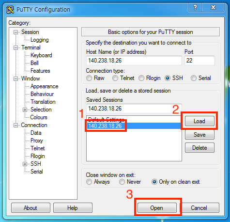
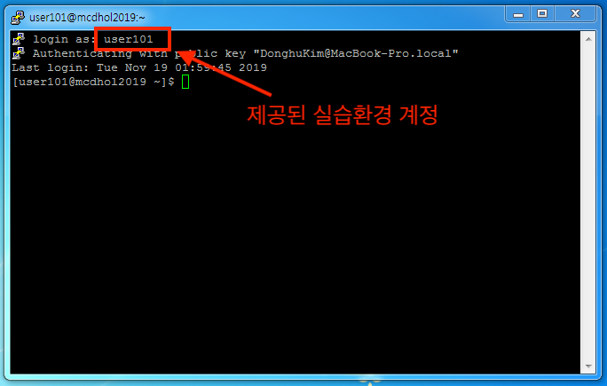
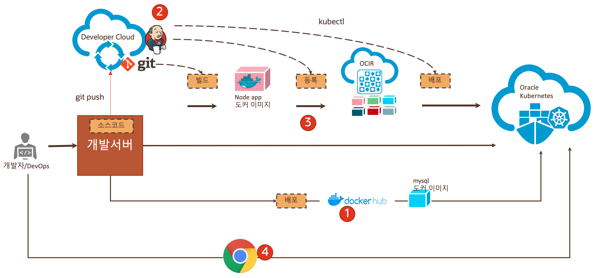

# CI/CD with OKE(Oracle Container Engine for Kubernetes) Hands-On
 (Oracle Modern Cloud Day 2019의 Tech Hands-on Track)

 
## Introduction
본 핸즈온 문서는 Oracle Developer Cloud Service를 사용하여 간단한 샘플 Application을 Oracle Container Engine for Kubernetes 에 배포하고 CI/CD 기능을 활용해 자동으로 빌드하고 배포하는 과정을 다루고 있습니다. 본 과정을 통해서 기본적인 오라클 Devleloper Cloud의 CI/CD 기능과 Oracle Kubernetes의 기능들을 경험을 해볼 수 있습니다.

## Objectives
* OKE(Oracle Container Engine for Kubernetes) 의 이해
* Developer Cloud Service의 CI/CD 확인

## Required Artifacts
* 인터넷 접속 가능한 PC
* OCI (Oracle Cloud Infrastructure) 계정
* SSH Terminal (windows Putty, macOS Terminal 등)

## 제공 환경 정보
* 실습 개발 환경(Linux) IP : 140.238.18.26
* 사용자명 / Password : Paper로 제공
* 오라클 클라우드 접속 계정 : Paper로 제공
  
## 실습을 위한 클라이언트 환경 및 접속 
본 실습을 위해서 각 개인별로 한 개의 Oracle Cloud Trial과 실습을 진행하기 위한 클라이언트 환경을 제공합니다.  
클라이언트 환경 접속에 대한 정보는 별도로 제공합니다.  

접속은 Putty 프로그램을 활용합니다.

> 참고 : macOS 사용자는 다음 링크에서 키를 다운로드 받아 압축 해제한 후 다음과 같이 접속합니다.
> 
> ssh -i id_rsa 사용자명@140.238.18.26
> 
> [sshkey 다운로드](https://objectstorage.ap-seoul-1.oraclecloud.com/n/apackrsct01/b/bucket-20190614-1639/o/sshkeys.zip)

## 시나리오

## Hands-On 순서

1. [Oracle Kubernetes 환경 확인하기](./oke.md)
2. [Developer Cloud Service 에 접속하기](./devcs.md)
3. [Developer Cloud Service 에서 Build 생성하기](./cicd.md)
4. [Application 확인, CI/CD 를 통한 자동화](./app.md)