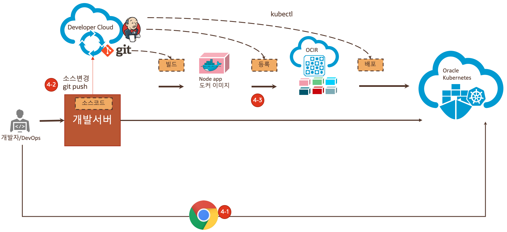
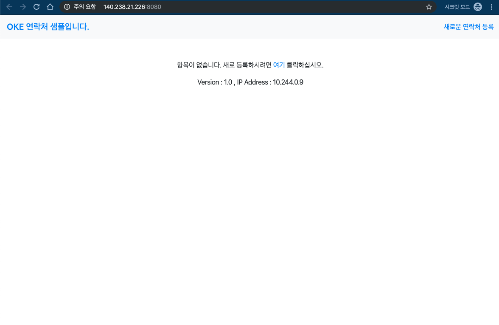
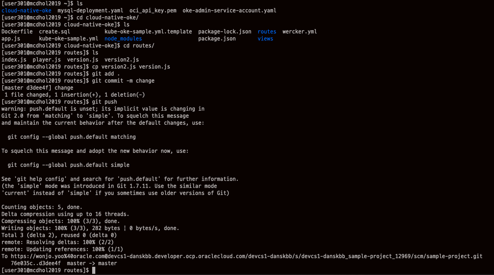
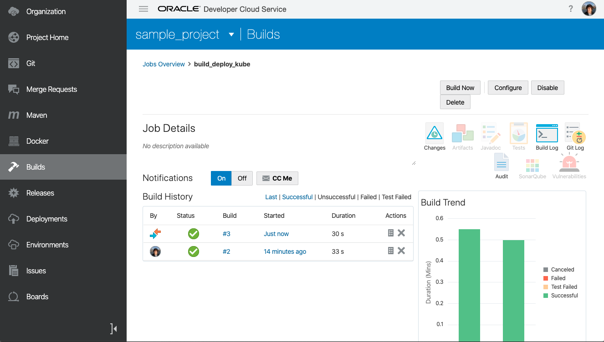
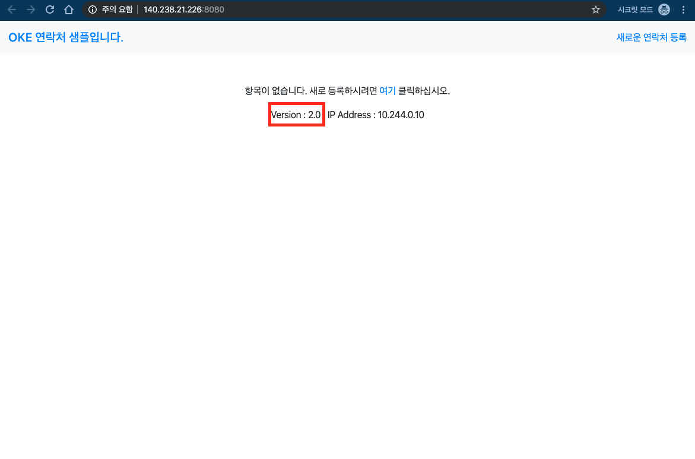

# 4. Application 확인, CI/CD 를 통한 자동화
## Lab 설명


이번 Lab에서는 Sample Application을 호출해보고 클라이언트에서 소스를 변경해서 자동으로 반영이 되는지를 확인합니다.

## **STEP 1**: Sample Application 확인하기

1. 서비스를 확인하기 위해서는 먼저 서비스 IP를 확인해야 합니다. 다음 명령어를 실습 개발 환경에서 수행합니다.
    ```
    $ kubectl get services
    NAME         TYPE           CLUSTER-IP     EXTERNAL-IP       PORT(S)          AGE
    kubernetes   ClusterIP      10.96.0.1      <none>            443/TCP          15h
    mysql        ClusterIP      10.96.18.163   <none>            3306/TCP         128m
    oke-sample   LoadBalancer   10.96.131.94   158.101.132.146   8080:32010/TCP   30s
    ```
1. 여기서 oke-sample의 외부 IP 정보가 나옵니다. 158.101.132.146 포트는 8080 인 것을 확인할 수 있습니다.
이처럼 각자의 IP를 확인해서 브라우저에 http://{IP Address}:8080/ 으로 호출해 봅니다.


3. 링크를 클릭하면 배포된 간단한 주소록 프로그램인 sample-app 이 열리게 됩니다.


## **STEP 2**: 소스 변경 후 Git Repository 에 반영하기
다시 실습 개발 환경으로 돌아가서 소스를 변경해 보도록 하겠습니다.
소스를 변경한 후 Local Git에 Commit을 하고 원격 Git Repository에 Push를 해서 자동으로 Build가 수행되어 Docker Registry에 등록되고, 이를 Kubernetes에 배포하는 과정이 수행되게 됩니다.

1. 소스 변경
   $HOME/cloud-native-oke/routes/version.js 파일의 내용은 단순히 다음과 같고 여기에서 version 정보를 1.0에서 2.0으로 변경해 보도록 하겠습니다. 미리 version2.js 파일을 준비해 놓았습니다.
    ```
    var version = "1.0";
    exports.version = version;
    ```
    
2. 실습개발 환경 계정의 Home에서 다음의 명령어를 입력합니다.
    ```
    cd cloud-native-oke
    cd routes
    cp version2.js version.js
    ```
3. Local Git에 소스 변경내용을 commit 하고 Developer Cloud Service에 있는 원격 Repository에 push하겠습니다.
    ```
    git add .
    git commit -m changeversion
    git push
    ```
    정상적으로 수행되면 다음과 같이 나오게 됩니다.
    

## **STEP 3**: 변경 내용 확인하기
1. Developer Cloud 의 Builds 탭에서 보면 새로운 build가 자동으로 수행 된 것을 확인할 수 있습니다. Build 생성시에 Git Repository를 계속 모니터링하고 있다가 소스가 변경이 된 것을 감지해 Build가 자동 수행이 되도록 설정을 했기 때문입니다.



1. Application 페이지를 Refresh 해보면 version 정보가 변경된 것을 확인 할 수 있습니다.


1. 조금 유심히 보게 되면 version정보 옆에 나오는 IP Address가 변경된 것을 알 수 있습니다. Container 를 담고 있는 Pod가 변경이 되면서 내부 IP가 변경이 되게 됩니다. 하지만 주소창에 있는 서비스 IP는 변경이 되지 않습니다. 이 IP는 앞단에 있는 Load Balancer의 IP이고 Load Balancer에서 새로 생성된 Pod로 연결을 자동으로 변경해주게 됩니다.

----

모든 Lab 과정을 마쳤습니다.
수고하셨습니다.

모든 과정을 빨리 끝내신 분들은 아래의 Lab을 추가적으로 해보시면 됩니다.

[조금 더 살펴보기](./more.md)