# 3. Developer Cloud Service 에서 Build 생성하기
## Lab 설명
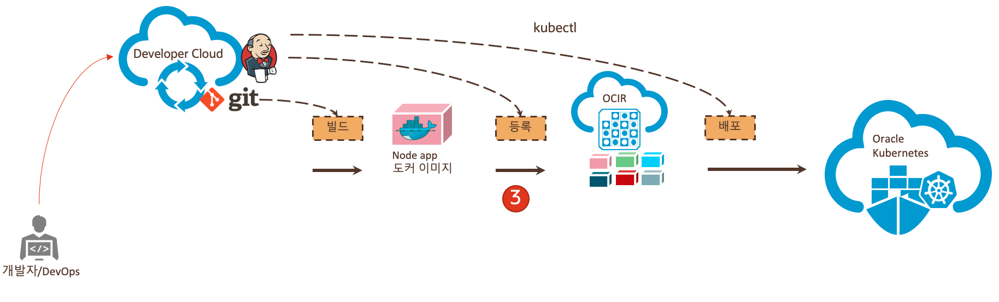

이번 Lab에서는 Developer Cloud Service를 사용해서 CI/CD를 위한 Build를 생성합니다.

자동으로 배포가 되게 하기 위해 Build를 생성하는 단계로 다음의 Task를 하게 됩니다.
###
> 1. Git 저장소 선택
> 2. 환경변수 세팅
> 3. Docker Login, Build, Push
> 4. Kubernetes 에 Deploy 설정
> 5. Build

## **STEP 1**: Git 저장소 선택
1. Developer Cloud에서 왼쪽 메뉴에서 Builds 탭을 클릭합니다.
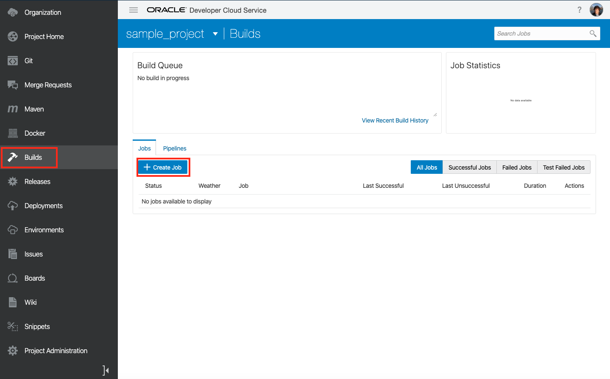

1. New Job을 클릭합니다. build의 이름을 임의로 입력합니다. 여기서는 build_deploy_kube 라고 하겠습니다. Template는 미리 생성해 놓은 build_vm을 선택합니다. 
   빌드시에 사용할 VM 인스턴스를 선택하는 단계입니다.
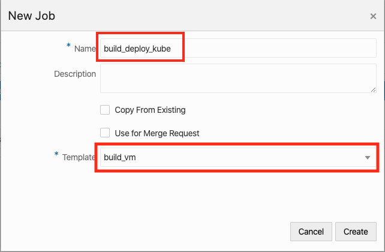


1. Job을 생성한 후에는 Build시에 사용할 Git 저장소를 선택합니다. 어떤 소스를 사용해서 Build를 할지를 선택하게 됩니다.
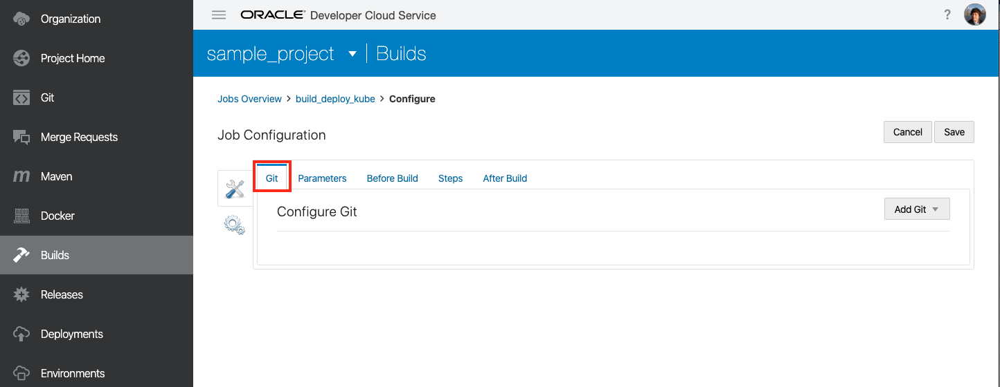

1. Add Git 버튼을 누릅니다.

1. Repository에서 sample-project.git을 선택합니다. 이때 Automatically perform build on SCM commit 버튼을 체크합니다. 이 부분이 바로 git에 소스가 변경이 되었을때 자동으로 이 build가 수행되도록 해주는 기능입니다.
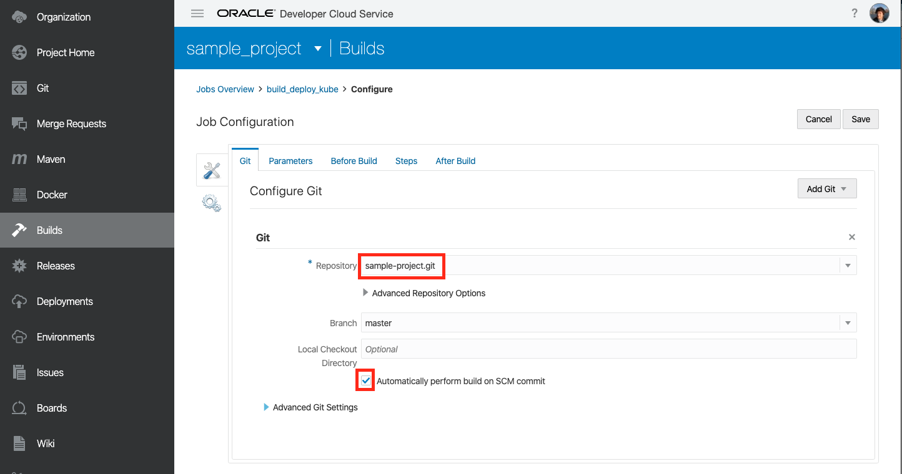

## **STEP 2**: 환경변수 세팅
1. 다음올 환경변수 값을 세팅하기 위해 Parameter를 선택합니다. 이 값들은 build Step에서 환경 변수로 사용합니다.
   오른쪽에 Add Parameter 를 선택 하고 String Parameter를 선택한 후 아래의 값을 입력합니다.
    

1. 먼저 Kubernetes 주소를 변수로 입력합니다.   
    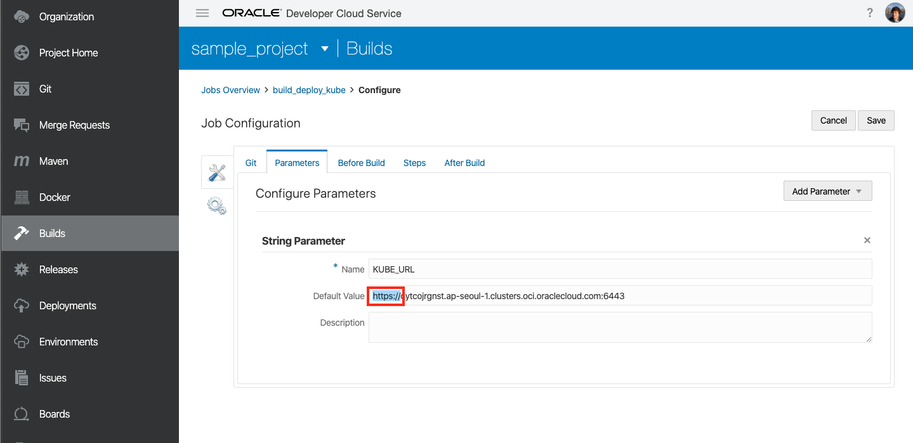
    ```
    Name : KUBE_URL
    Default Value : https://[Kubernetes Master 서버 주소]
    ```
    앞에 https 를 반드시 입력해야 합니다.
    여기서 Kubernetes 주소는 OCI 콘솔의 Containers->Clusters에서 확인이 가능합니다.
    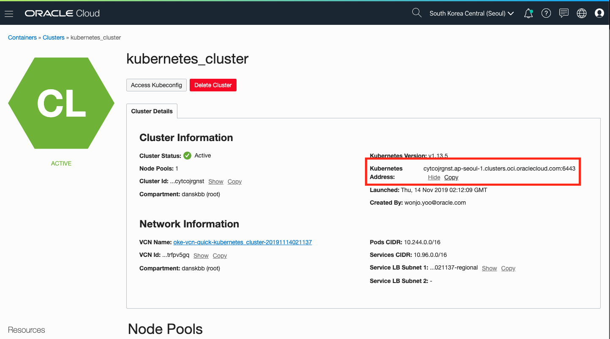

1. 다시 String Parameter를 선택해서 다음을 입력합니다.
    Name: KUBE_TOKEN
    Default Value : 이전 Lab에서 아래의 명령어로 얻은 Token값을 넣습니다.
    ```
    $ kubectl -n kube-system describe secret $(kubectl -n kube-system get secret | grep oke-admin | awk '{print $1}')
    ```
    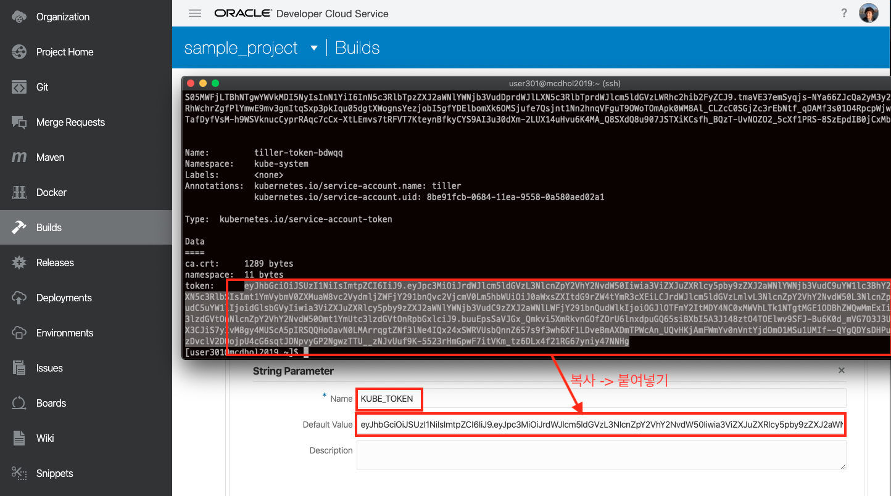

1. 마지막으로 생성할 docker image의 이름을 변수로 넣어줍니다.
    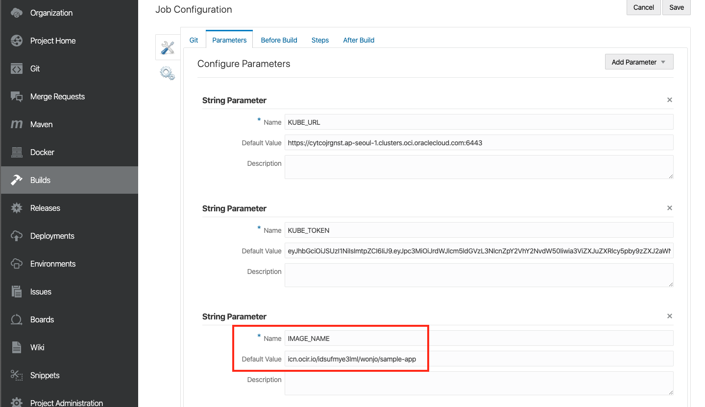
    
    - IMAGE_NAME 형식
        > **{region_code}.ocir.io/{tenancy_namespace}**/sample-app
      
      ``` 
      예) Default Value : icn.ocir.io/idsufmye3lml/sample-app 
      ```

1. 중간에 저장을 한번 하기 위해 Save버튼을 누릅니다.
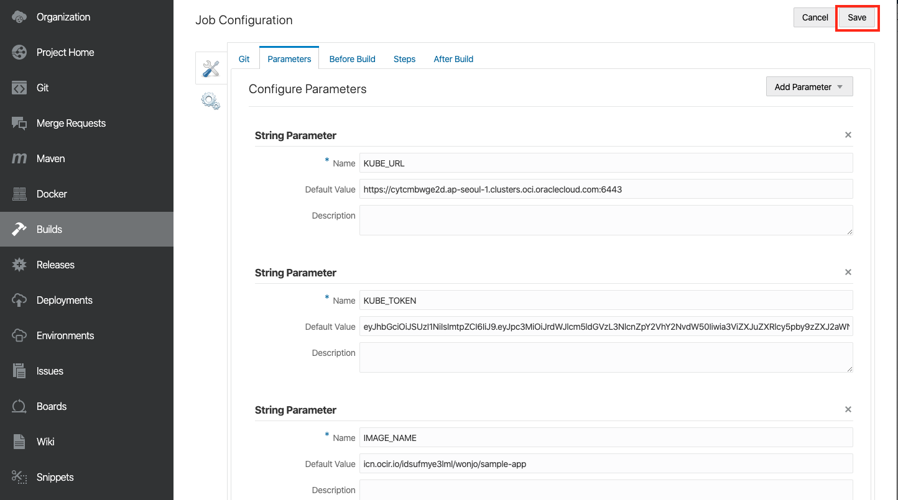

## **STEP 3**: Docker Login, Build, Push
1. 오른쪽 상단의 Configure 버튼을 누릅니다.
   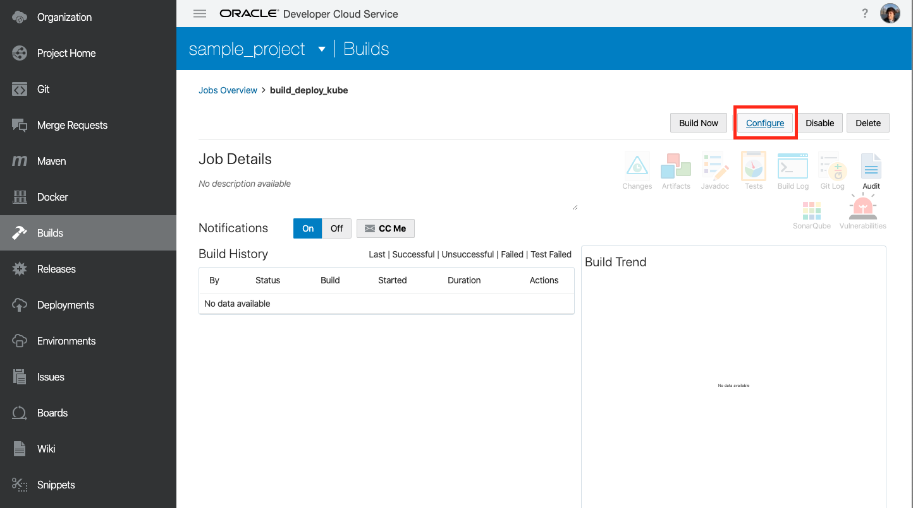

1. Steps를 누른 후 Add Step --> Docker --> Docker Login을 선택합니다.
    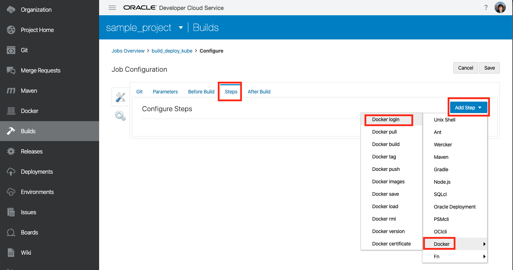

1. 앞에서 등록한 OCIR Docker Registry인 OCIR1 을 선택하면 자동으로 계정정보가 입력됩니다.
    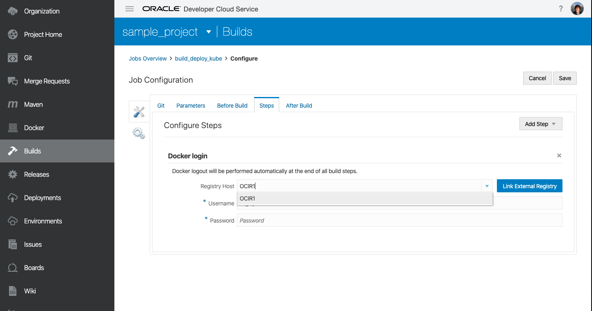

1. 두번째 단계인 Docker Build를 선택합니다. 
    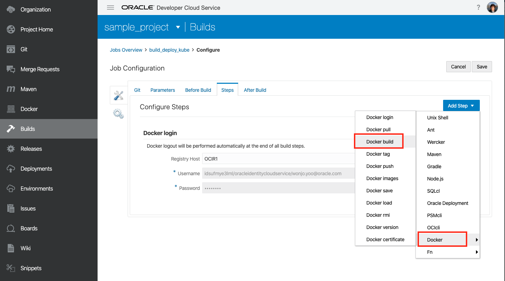

1. 아래의 정보를 입력합니다.
    - IMAGE_NAME 형식
        > **{tenancy_namespace}**/sample-app
    
    ```
        Docker Build
        예) Image Name : idsufmye3lml/sample-app
        Version Tag : $BUILD_NUMBER
        Source : 
        Context Root in Workspace 선택
    ```
    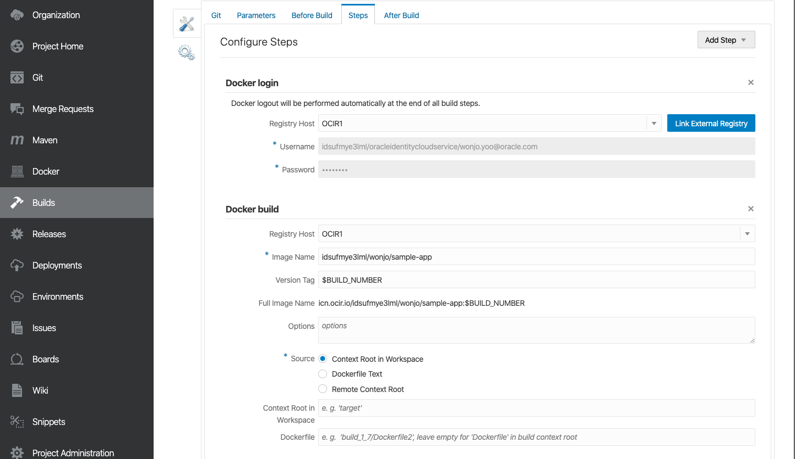    

1. 동일한 과정으로 Docker Push를 선택하고 아래의 정보를 입력합니다. 
    ```
    Docker Push
    예) Image Name : idsufmye3lml/sample-app
    ```
    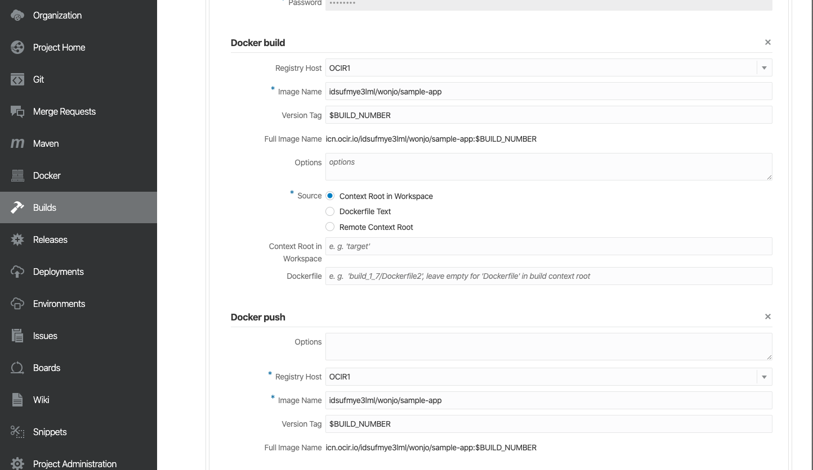

## **STEP 4**: Kubernetes 에 Deploy 설정
1. 마지막으로 Unix Shell을 선택합니다.
   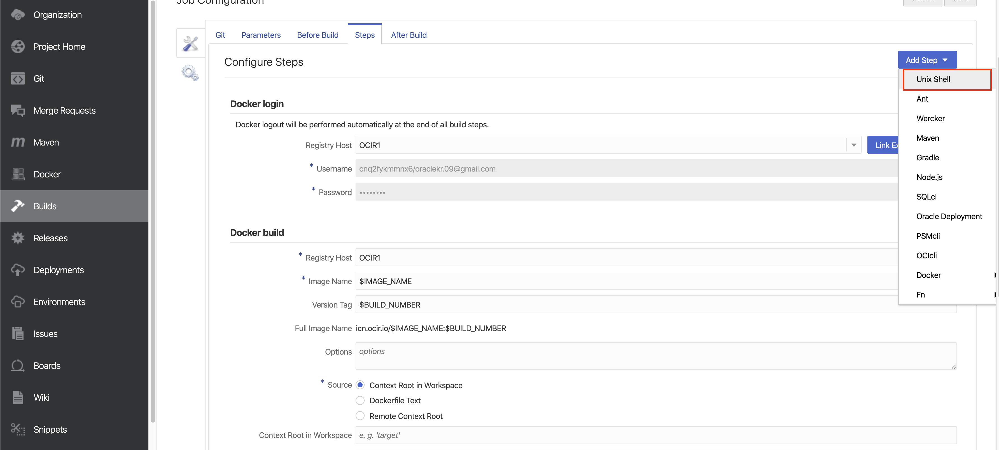

1. kubernetes 에 deploy하는 단계 입니다. kube-oke-sample.yaml 파일을 실행하는 스크립트를 호출하기 위해 아래의 정보를 입력합니다.  
    ```
    export APP_IMAGE_NAME=$IMAGE_NAME:$BUILD_NUMBER
    envsubst < kube-oke-sample.yml | kubectl --insecure-skip-tls-verify --server $KUBE_URL --token $KUBE_TOKEN apply -f -
    ```
    
    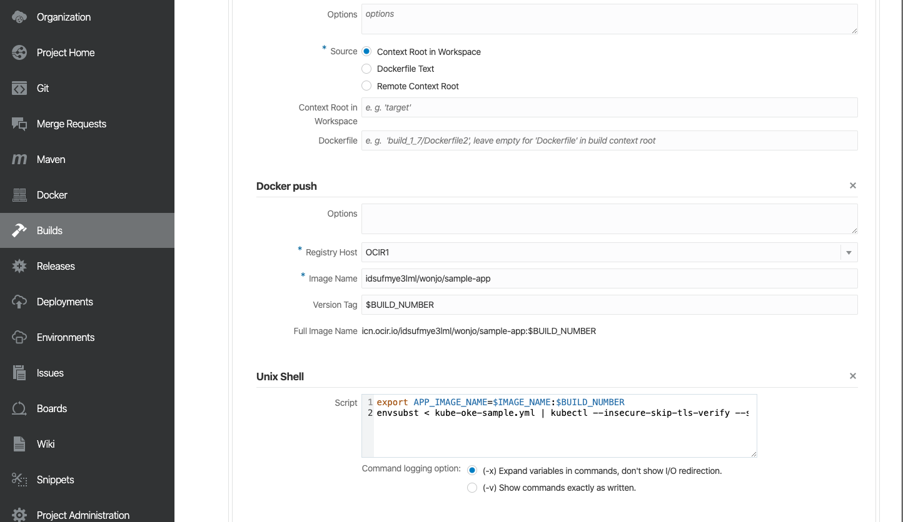
2. 위쪽에 Save 버튼을 누릅니다.

## **STEP 5**: Build
3. 준비가 되었습니다. 바로 눌러서 Build를 해보겠습니다. Build Now 버튼을 누릅니다.
   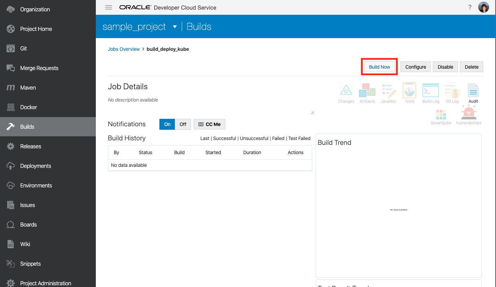
4. 앞에서 설정한 파라미터 값을 변경할 수 있는 Popup이 뜹니다. Default 값을 이미 입력했기 때문에 Build Now 를 바로 누릅니다.
    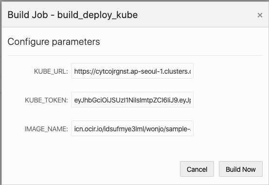

5. 잠시 작업 Queue에 들어갔다가 Build를 시작하게 됩니다.
    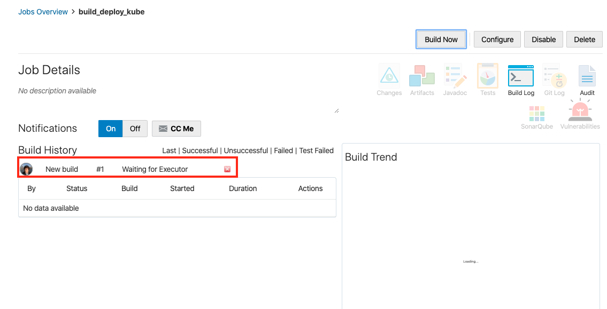

1. build가 성공적으로 수행되었습니다. 오른쪽 상단에 build log 버튼을 눌러 log를 확인해 보겠습니다.
    

1. 에러가 발생한 경우에는 이곳에서 build log를 확인할 수 있습니다. 
    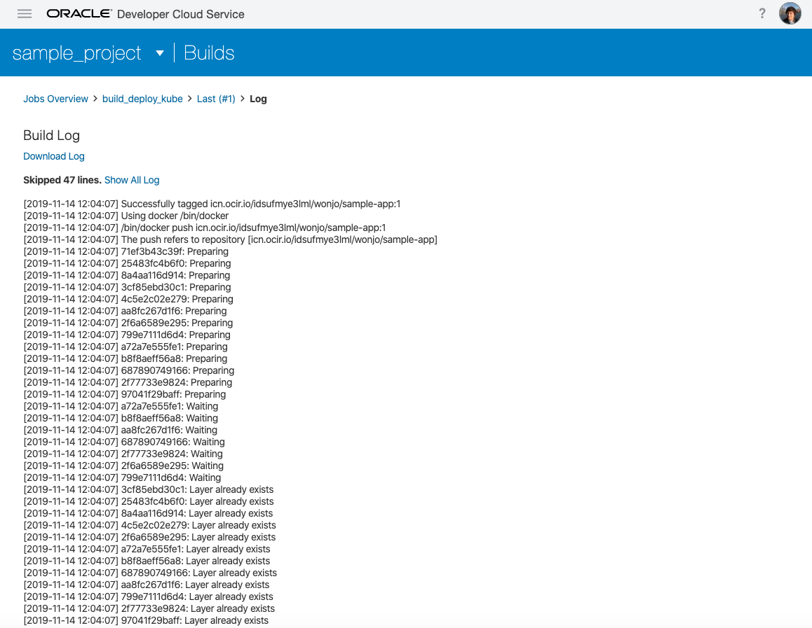


이번 Lab을 모두 마치셨습니다.

----
다음 Lab 으로 이동  
[4. Application 확인, CI/CD 를 통한 자동화](./app.md)
