# 3. Developer Cloud Service 에서 Build 생성하기
## Lab 설명


이번 Lab에서는 Developer Cloud Service를 사용해서 CI/CD를 위한 Build를 생성합니다.

자동으로 배포가 되게 하기 위해 Build를 생성하는 단계로 다음의 Task를 하게 됩니다.
###
> 1. Git 저장소 선택
> 2. 환경변수 세팅
> 3. Docker Login, Build, Push
> 4. Kubernetes 에 Deploy 설정
> 5. Build

## **STEP 1**: Git 저장소 선택
1. Developer Cloud에서 왼쪽 메뉴에서 Builds 탭을 클릭합니다.


1. Create Job을 클릭합니다. build의 이름을 임의로 입력합니다. 여기서는 build_deploy_kube 라고 하겠습니다. Template는 미리 생성해 놓은 build_vm을 선택합니다. 
   빌드시에 사용할 VM 인스턴스를 선택하는 단계입니다.


1. Job을 생성한 후에는 Build시에 사용할 Git 저장소를 선택합니다. 어떤 소스를 사용해서 Build를 할지를 선택하게 됩니다.


1. Add Git 버튼을 누릅니다.
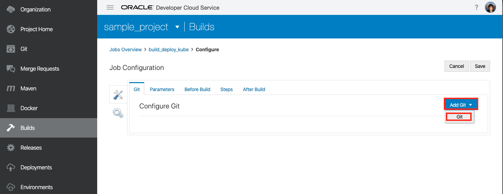
1. Repository에서 sample-project.git을 선택합니다. 이때 Automatically perform build on SCM commit 버튼을 체크합니다. 이 부분이 바로 git에 소스가 변경이 되었을때 자동으로 이 build가 수행되도록 해주는 기능입니다.


## **STEP 2**: 환경변수 세팅
1. 환경변수는 4개를 세팅합니다. 환경변수 값을 세팅하기 위해 Parameters를 선택합니다. 이 값들은 build Step에서 환경 변수로 사용합니다.
   오른쪽에 Add Parameter 를 선택 하고 String Parameter를 선택한 후 아래의 값을 입력합니다.
    

1. 먼저 Kubernetes 주소를 변수로 입력합니다.   
    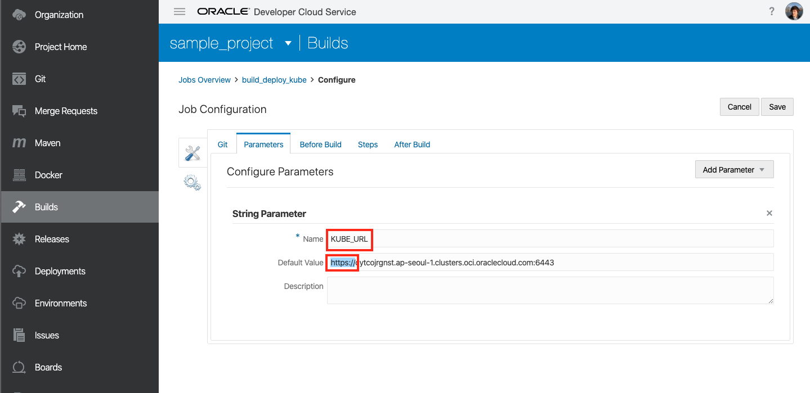
    
    > Name : <b>KUBE_URL</b><br>
    > Default Value : https://[Kubernetes Master 서버 주소]
    
    앞에 https 를 반드시 입력해야 합니다.
    
    Kubernetes 주소는 실습개발 환경에서 다음의 명령어로 확인이 가능합니다.
    ```
    $ kubectl cluster-info
    Kubernetes master is running at https://c4wmnjsmnst.ap-tokyo-1.clusters.oci.oraclecloud.com:6443
    ```

    또한 OCI 콘솔의 Containers->Clusters에서 확인이 가능합니다.
    
    
1. Add Parameter -> String Parameter를 선택해서 다음을 입력합니다.
    
    > Name: <b>KUBE_TOKEN</b><br>
    > Default Value : 아래의 명령어로 실습 개발 환경에서 실행을 한 후 가장 아래 부분에 나오는 Token값을 복사합니다.
    ```
    $ kubectl -n kube-system describe secret $(kubectl -n kube-system get secret | grep oke-admin | awk '{print $1}')
    ```
    

1. Add Parameter -> String Parameter를 두번 더 합니다.
    
    
    > NAME : **OCIR**<br>
    > Default Value형식 : **{region_code}.ocir.io**
      
      ``` 
      예) Default Value : icn.ocir.io (서울)
      예) Default Value : nrt.ocir.io (일본)
      ```

    > Name : <b>IMAGE_NAME</b><br>
    > Default Value 형식 : **{tenancy_namespace}**/sample-app
      
      ``` 
      예) Default Value : idsufmye3lml/sample-app
      ```

    - tenancy_namespace 는 실습개발환경에서 확인하실 수 있습니다.
        ```
        cat oci_info |grep name
        ```
        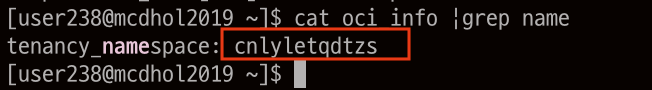
        
       <details>
        <summary><i>참고) OCI 콘솔에서 tenancy_name 확인하는 방법
        </i></summary>
        
        
        </details>        
        
2. 중간에 저장을 한번 하기 위해 Save버튼을 누릅니다.


## **STEP 3**: Docker Login, Build, Push
1. 오른쪽 상단의 Configure 버튼을 누릅니다.
   

1. Steps를 누른 후 Add Step --> Docker --> Docker Login을 선택합니다.
    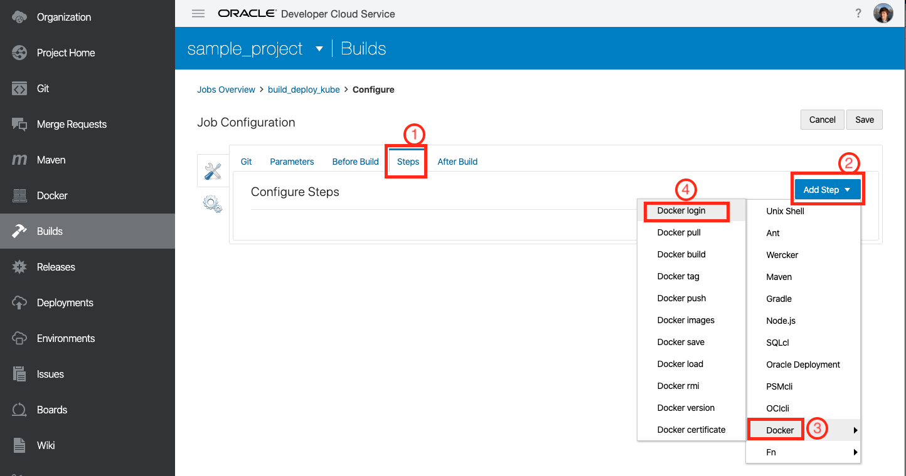

1. 앞에서 등록한 OCIR Docker Registry인 OCIR1 을 선택하면 자동으로 계정정보가 입력됩니다.
    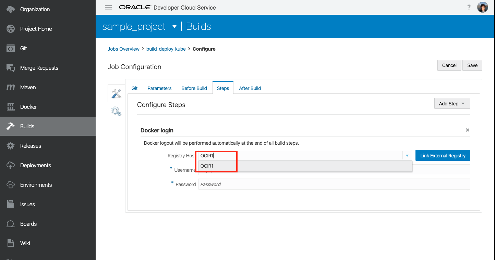

1. 두번째 단계인 Add Step --> Docker -->Docker Build를 선택합니다. 
    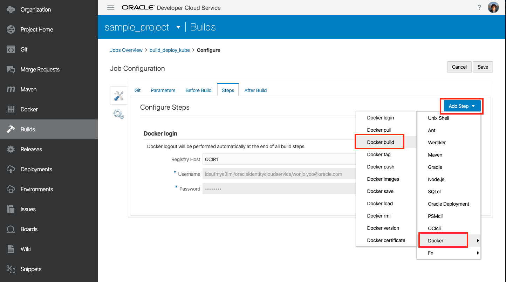

1. 아래의 정보와 동일하게 $IMAGE_NAME과 $BUILD_NUMBER라고 입력합니다.
    ```
        Docker Build
        Image Name : $IMAGE_NAME
        Version Tag : $BUILD_NUMBER
        Source : 
        Context Root in Workspace 선택
    ```

    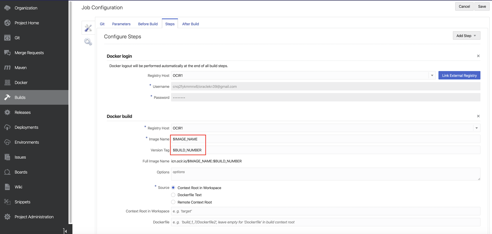    

1. 동일한 과정으로 Docker Push를 선택하고 아래의 정보를 입력합니다. 
    ```
    Docker Push
    Image Name : $IMAGE_NAME
    Vresion Tag : $BUILD_NUMBER
    ```

    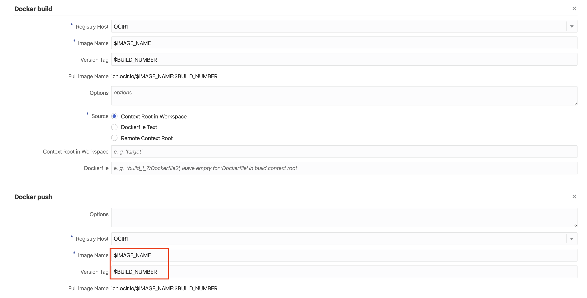

## **STEP 4**: Kubernetes 에 Deploy 설정
1. 마지막으로 Add Step --> Unix Shell을 선택합니다.
   

1. kubernetes 에 deploy하는 단계 입니다. kube-oke-sample.yaml 파일을 실행하는 스크립트를 호출하기 위해 아래의 정보를 그대로 복사해서 입력합니다.  
    ```
    export APP_IMAGE_NAME=$OCIR/$IMAGE_NAME:$BUILD_NUMBER
    envsubst < kube-oke-sample.yml | kubectl --insecure-skip-tls-verify --server $KUBE_URL --token $KUBE_TOKEN apply -f -
    ```
    
    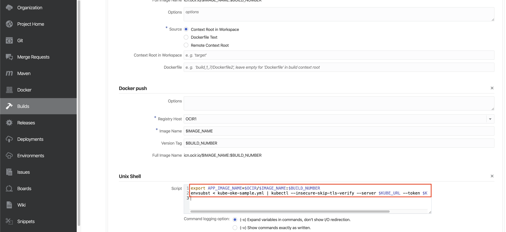
2. 위쪽에 Save 버튼을 누릅니다.

## **STEP 5**: Build
3. 준비가 되었습니다. 바로 눌러서 Build를 해보겠습니다. Build Now 버튼을 누릅니다. 이 과정은 처음 실행시에는 수분 정도 시간이 소요됩니다.
   
4. 앞에서 설정한 파라미터 값을 변경할 수 있는 Popup이 뜹니다. Default 값을 이미 입력했기 때문에 Build Now 를 바로 누릅니다.
    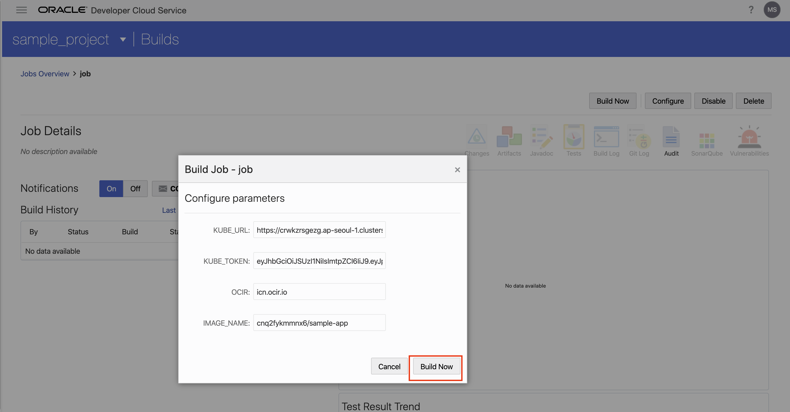

5. 잠시 작업 Queue에 들어갔다가 Build를 시작하게 됩니다.
    

1. build가 성공적으로 수행되었습니다. 오른쪽 상단에 build log 버튼을 눌러 log를 확인해 보겠습니다.
    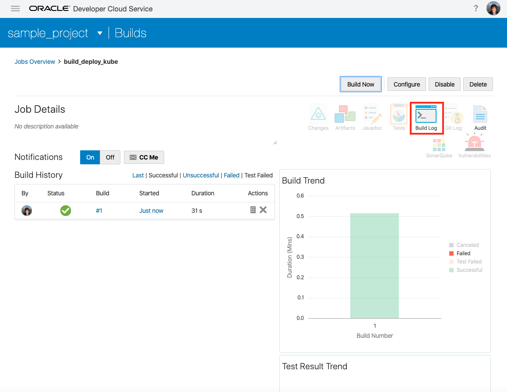

1. 에러가 발생한 경우에는 이곳에서 build log를 확인할 수 있습니다. 
    


이번 Lab을 모두 마치셨습니다.

----
다음 Lab 으로 이동  
[4. Application 확인, CI/CD 를 통한 자동화](./app.md)
