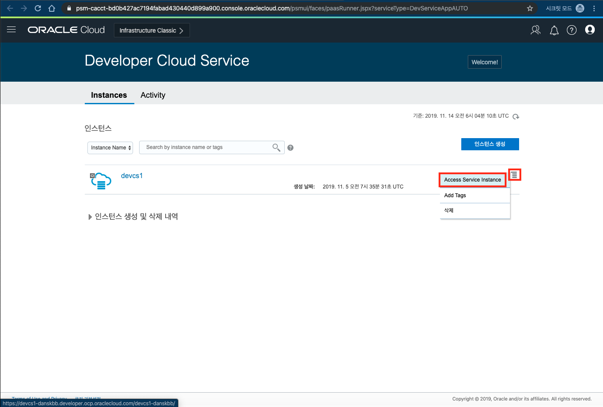
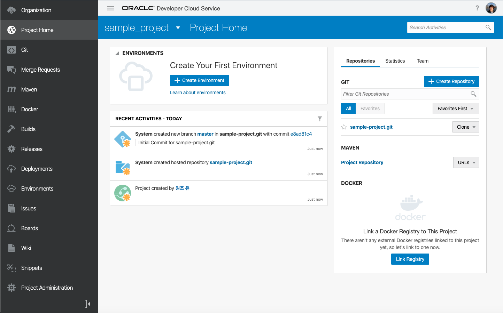
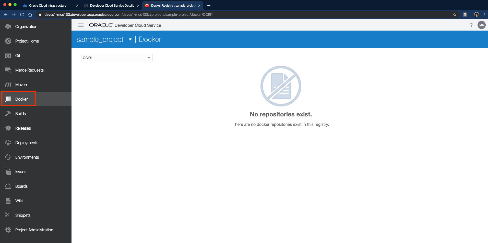

# 2. Developer Cloud Service 에 접속하기

## Lab 설명


이번 Lab에서는 Developer Cloud의 콘솔을 확인해 보고, 실습 개발 환경에 준비해 놓은 소스를 git 서버에 올립니다.

## **STEP 1**: Developer Cloud Service 환경 확인하기
1. Developer Cloud Service 인스턴스 Console에 접속합니다.
이미 1개의 인스턴스를 생성해 놓았습니다. 오른쪽에 햄버거 버튼을 클릭한 후 Access Service Instance 를 클릭해서 해당 인스턴스의 콘솔 화면으로 이동합니다.


1. 미리 준비해 놓은 sample_project 를 선택합니다.


3. Developer Cloud Service의 Project는 개발환경에 필요한 통합 된 기능을 모두 제공합니다. Git 리파지토리, Maven 리파지토리, Build 파이프라인, Agile 개발을 위한 Code Review기능, Wiki등을 제공합니다. 


4. 그 중에서 먼저 Git Repository를 확인해 보도록 하겠습니다. 왼쪽 메뉴에서 Git를 클릭해 봅니다. Git Repository는 Github과 같이 소스 버전 관리를 할 수 있습니다.


5. 왼쪽 메뉴에서 Docker 메뉴를 누르면 OCIR의 Registry 정보가 보여지게 됩니다. 빠른 실습을 위해 이미 Developer Cloud와 Docker Registry인 OCIR이 연결이 되어 있습니다. 

<details>
<summary><i>참고) Developer Cloud Service에서 OCIR(Oracle Cloud Infrastructure Registry) 직접 연결하기
</i></summary>

1. OCIR은 이전 Lab에서 확인했던 OCI 콘솔화면 중에서 Developer-> Containers->Registry 메뉴에서 확인할 수 있습니다.


1. OCIR을 연결하기 위햇 Developer Cloud Service에서 Docker 메뉴를 클릭해보겠습니다. Docker 메뉴에서는 외부 Docker Repository와 연결하는 기능을 제공해서 docker image를 가져오거나 push를 할 수 있는 기능을 제공합니다. 'Link External Registry'를 클릭합니다.


1. 아래의 정보와 같이 입력합니다. 
   
   
    1) Registry Name : 영문으로 입력
    1) Registry URL 
        > **{region_code}.ocir.io** (서울 리전의 예시: icn.ocir.io)<br>
        > regison_code는 https://docs.cloud.oracle.com/iaas/Content/General/Concepts/regions.htm 에서 확인가능

    1) Authentication : Basic 선택
    1) Username : <tenancy_name>/<oci_user_name>
    예:) idsufmye3lml/test@oracle.com
        - tenancy_name 확인
        
    1) Password : (OCI->User Setting->Auth Tokens에서 생성)
        - OCIR 로그인을 위한 임시 토큰 발행
            > OCI Console 로그인 후 우측 상단의 사용자 아이콘 클릭 > Profile 바로 밑의 사용자 아이디를 클릭 > 좌측 Auth Tokens 클릭 > Generate Token 클릭 > Description에 **ocir-token** 입력 후 Generate Token 클릭 > 생성된 토큰을 복사

        

    
1. 정상적으로 입력이 되면 연결 테스트를 하고 Registry 정보가 보여지게 됩니다.

</details>


## **STEP 3**: 실습 개발 환경에서 Developer Cloud Service의 Git로 소스 Push하기
1. 실습 개발 환경에서 ls 를 해보면 cloud-native-oke 라는 폴더가 있습니다.
    ```
    [user301@mcdhol2019 ~]$ ls
    cloud-native-oke  mysql-deployment.yaml  oci_api_key.pem  oke-admin-service-account.yaml
    ```
1. cloud-native-oke는 node.js로 되어 있는 web application입니다. 해당 폴더로 이동합니다.
   ```
    [user301@mcdhol2019 ~]$ cd cloud-native-oke
    ```
1. ls를 해보면 node.js파일들과 함께 docker image를 만들기 위한 Dockerfile과 kubernetes에 배포하기 위한 kube-oke-sample.yml 파일이 있습니다. 
   ```
    [user301@mcdhol2019 cloud-native-oke]$ ls
    Dockerfile  app.js      kube-oke-sample.yml           node_modules       package.json  views
    README.md   create.sql  kube-oke-sample.yml.template  package-lock.json  routes        wercker.yml
    ```
2. 이 파일들을 Remote에 있는 Developer Cloud의 git Repository 에 push하기 위해 다음의 순서로 실행합니다.
   ```
    git init
    git config --global user.name $USER
    git config --global user.email "[제공된 이메일]"
    git config credential.helper store

    git remote add origin [원격지 Git 주소]
    git pull origin master
    Password for 'https://xxxxx@oracle.com@devcs1-danskbb.developer.ocp.oraclecloud.com':
    ```
    원격지 Git 주소는 Developer Cloud의 다음 화면에서 복사할 수 있습니다.

    git 비밀번호는 제공된 클라우드 계정에 대한 비밀번호 를 입력하시면 됩니다.

    ```
    remote: Counting objects: 3, done
    remote: Finding sources: 100% (3/3)
    remote: Getting sizes: 100% (2/2)
    ```
    원격지의 git repository와 현재 디렉토리가 정상적으로 연결이 되었습니다. 
    
1. 이제 실습 개발 환경에 있는 소스를 올려보도록 하겠습니다.
    ```
    git add .
    git commit -m 'change1'
    git push
    ```
1. Developer Cloud 에 가서 소스가 모두 반영되었는지 확인해보도록 하겠습니다. Git 메뉴를 클릭하면 파일들이 생성된 것을 확인할 수 있습니다.
   


이번 Lab을 모두 마치셨습니다.

----
다음 Lab 으로 이동  
[3. Developer Cloud Service 에서 Build 생성하기](./cicd.md)
