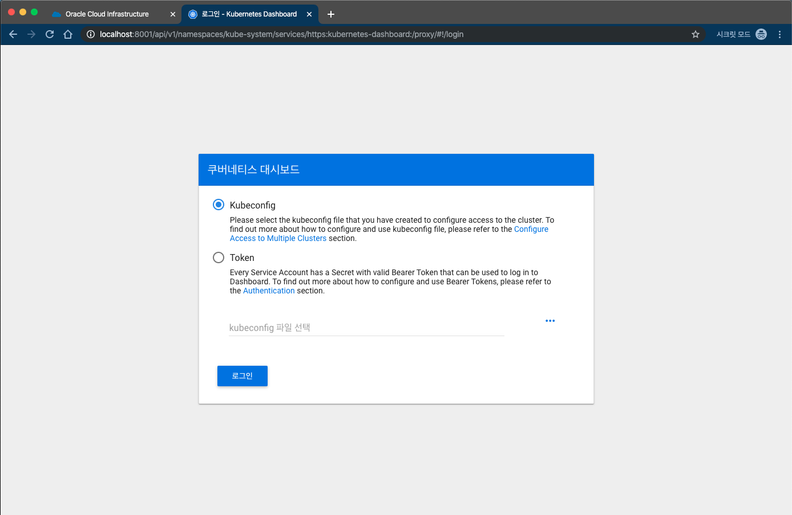
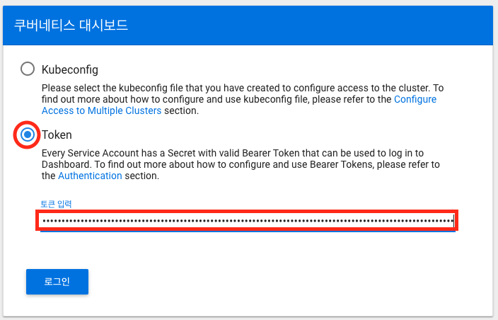

# 5. Kubernetes Dashboard 
## Lab 설명

## **STEP 1**: 브라우저를 통해 Kubernetes Dashboard 열기

이제 Kubernetes Dashboard 에 접속해 보도록 하겠습니다. 쿠버네티스는 자체 Dashboard를 제공하고 있는데, 보안상 localhost에서만 접근을 하도록 막혀 있습니다. 이 Lab에서는 개발환경에서 localhost로 띄우고 여러분의 Local Pc에서 SSH Tunneling을 통해서 접근하도록 하겠습니다. 

1. 먼저 Kubernetes Proxy를 띄웁니다. alias로 만들어 놓은 kubeproxy를 실행합니다.
    ```
    $ kubeproxy
    Starting to serve on 127.0.0.1:포트
    ```

3. Local PC에서 개발환경 서버로 위 포트로 Tunneling을 합니다. 별도의 창을 띄워 놓아야 합니다.
   ```
    윈도우 : putty로 아래와 같이 설정해서 접속
    ```

    ```
    Mac : ssh -i id_rsa -L 8001:127.0.0.1:포트 사용자명@140.238.18.26
    ```
4. 브라우저에서 다음의 주소로 접속해 봅니다.
http://localhost:8001/api/v1/namespaces/kube-system/services/https:kubernetes-dashboard:/proxy/#!/login

    

1. Kubernetes 에 접근하기 위한 인증 Token을 얻기 위해서 다시 아래와 같이 명령어를 입력합니다.
    ```
    $ kubectl -n kube-system describe secret $(kubectl -n kube-system get secret | grep oke-admin | awk '{print $1}')
    ```

    
    위에서 token: 다음 부분부터 복사를 해두고, 다음 화면에서 Token을 선택한 후 붙여 넣기를 합니다. 이제 로그인 버튼을 누릅니다.
    

1. 이제 정상적으로 로그인이 되었습니다.

왼쪽 메뉴에서 노드 와 서비스를 눌러 보면 위에서 명령어로 입력한 정보와 동일한 것을 확인하실 수 있습니다.

----

모든 Lab 과정을 마쳤습니다.
수고하셨습니다.
