# 1. Oracle Kubernetes 환경 확인하기
## Lab 설명
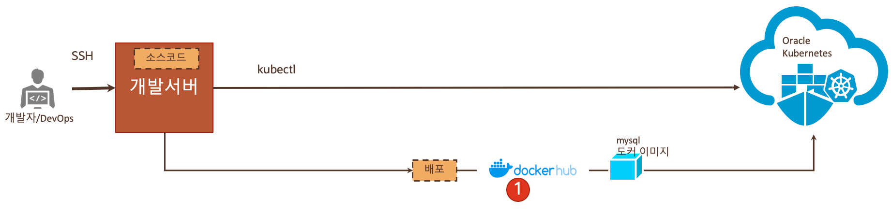
이번 Lab에서는 미리 준비해 놓은 오라클 클라우드에 접속해 보고, 실습 개발 환경에 SSH로 접속해서 Kubernetes CLI 명령어를 실행해봅니다.

## **STEP 1**: OKE(Oracle Container Engine for Kubernetes) 환경 확인하기

1. 먼저 OCI Console에 로그인합니다. https://console.us-ashburn-1.oraclecloud.com 접속 후 Tenant 입력 > **Continue** 클릭
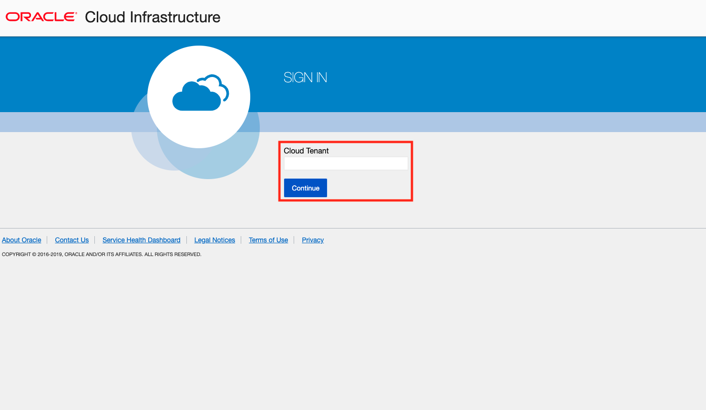

2. Identity Provider를 oracleidentitycloudservice 선택(Default) > **Continue** 클릭
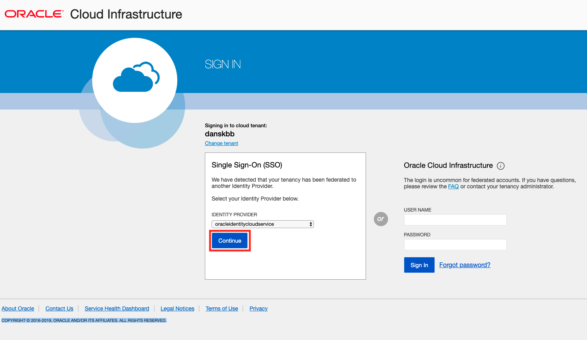

3. 사용자 이름(User Name)과 암호(Password) 입력 후 **Sign In** 클릭
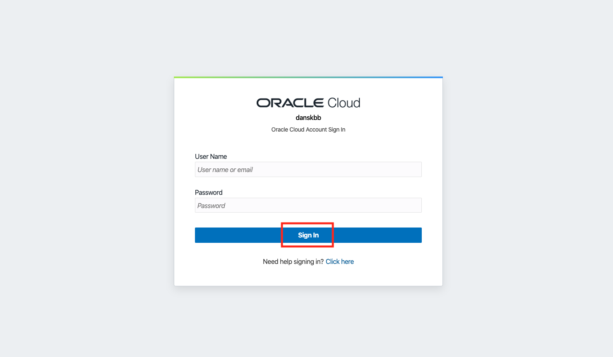

4. OCI Main 페이지, **I accept all cookies** 클릭하여 쿠키 수락
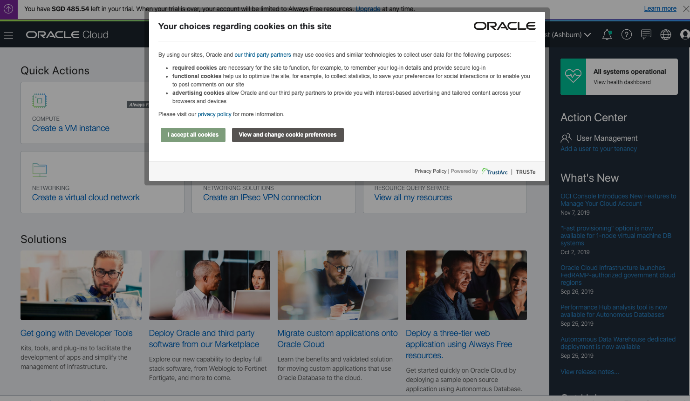

5.  좌측 상단의 햄버거 모양의 메뉴 아이콘 클릭 > Developer Services 선택 > Container Clusters(OKE) 선택
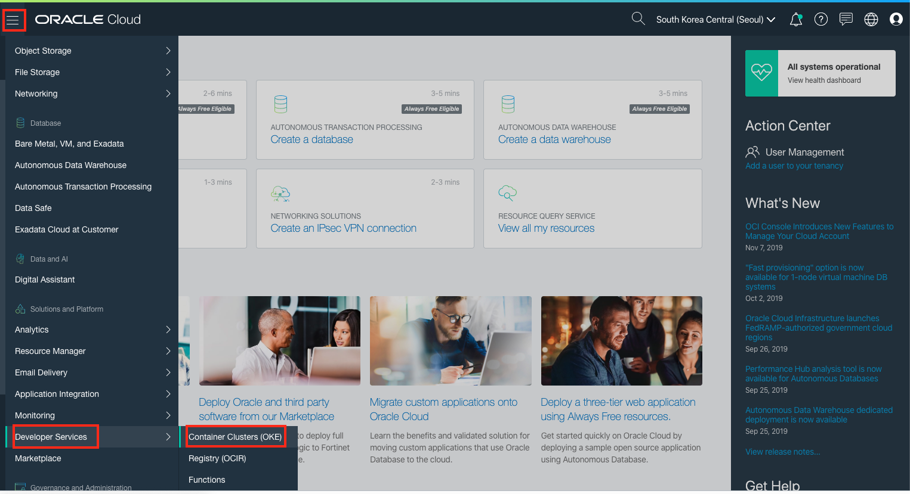

6. 미리 생성되어 있는 클러스터가 보일 것입니다. 생성되어 있는 클러스터를 클릭합니다.
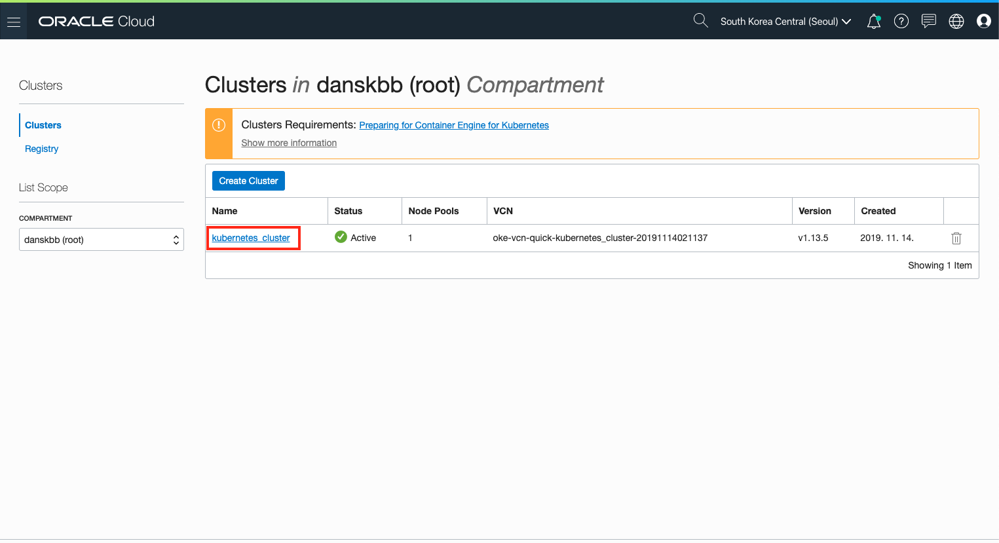

7. Node Pools에 1개의 Node가 생성되어 있는 것을 확인합니다. 
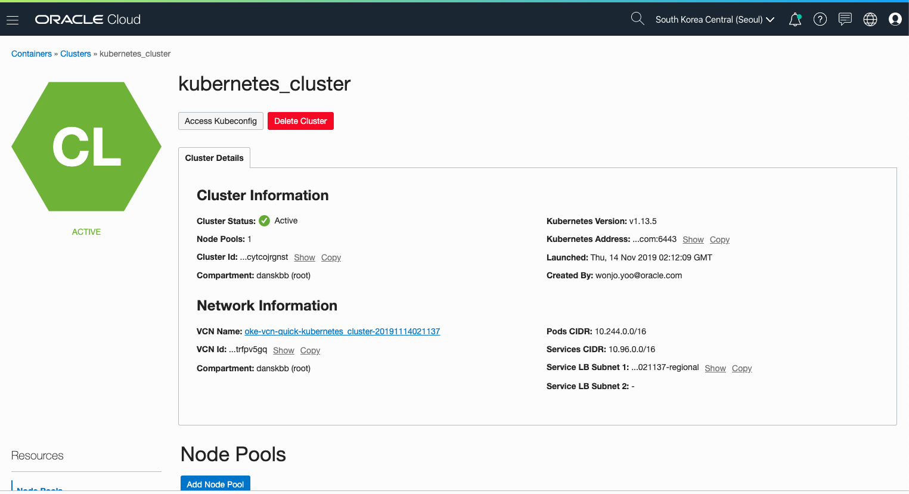

1. 이제 여러분의 실습 개발 환경에서 위 클러스터에 접속을 해보도록 하겠습니다. 먼저 ssh로 각자의 개발환경에 접속합니다.
   
    ```
    ssh -i id_rsa 사용자명@140.238.18.26
    ```
1. 이 개발 환경에서는 여러분의 kubernetes cluster에 대한 정보가 .kube 디렉토리에 이미 설정되어 있습니다. kubernetes cli 툴을 통해서 클러스터의 접속 정보를 확인해 봅니다. 
    ```
    $ kubectl cluster-info
    ```
    이 명령어를 치시면 아래와 같이 나오게 됩니다.
    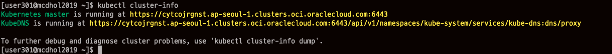
2. 다른 명령어도 확인해 보도록 하겠습니다.
   ```
    $ kubectl get node
    NAME        STATUS   ROLES   AGE    VERSION
    10.0.10.2   Ready    node    139m   v1.13.5
    
    $ kubectl get service
    NAME         TYPE        CLUSTER-IP   EXTERNAL-IP   PORT(S)   AGE
    kubernetes   ClusterIP   10.96.0.1    <none>        443/TCP   145m

1. kubernetes에 mysql 를 배포해서 띄워 보도록 하겠습니다. 예제에서 사용할 스키마까지 생성되는 docker image를 바로 배포하도록 하겠습니다.
    아래 명령어를 입력합니다.
    ```
    $ kubectl -f mysql-deployment.yaml apply
    ```

    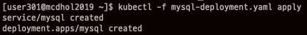

1. 아래 명령어를 통해서 서비스의 상태를 확인 해 봅니다. mysql이 배포가 된 것을 확인할 수 있습니다.    
   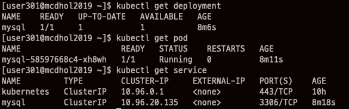
   
2. 이제 Kubernetes Dashboard 에 접속해 보도록 하겠습니다. 쿠버네티스는 자체 Dashboard를 제공하고 있는데, 보안상 localhost에서만 접근을 하도록 막혀 있습니다. 이 Lab에서는 개발환경에서 localhost로 띄우고 여러분의 Local Pc에서 SSH Tunneling을 통해서 접근하도록 하겠습니다. 먼저 Kubernetes Proxy를 띄웁니다. alias로 만들어 놓은 kubeproxy를 실행합니다.
    ```
    $ kubeproxy
    Starting to serve on 127.0.0.1:포트
    ```

3. Local PC에서 개발환경 서버로 위 포트로 Tunneling을 합니다. 별도의 창을 띄워 놓아야 합니다.
   ```
    윈도우 : putty로 아래와 같이 설정해서 접속
    ```

    ```
    Mac : ssh -i id_rsa -L 8001:127.0.0.1:포트 사용자명@140.238.18.26
    ```
4. 브라우저에서 다음의 주소로 접속해 봅니다.
http://localhost:8001/api/v1/namespaces/kube-system/services/https:kubernetes-dashboard:/proxy/#!/login

    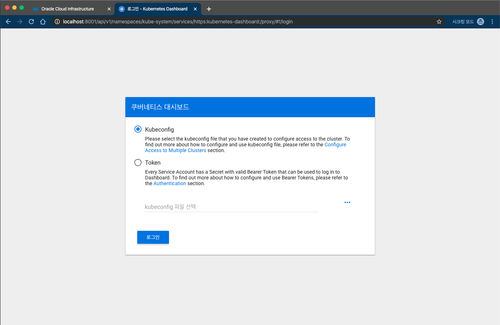

1. Kubernetes 에 접근하기 위한 인증 Token을 얻기 위해서 다시 아래와 같이 명령어를 입력합니다.
    ```
    $ kubectl -n kube-system describe secret $(kubectl -n kube-system get secret | grep oke-admin | awk '{print $1}')
    ```

    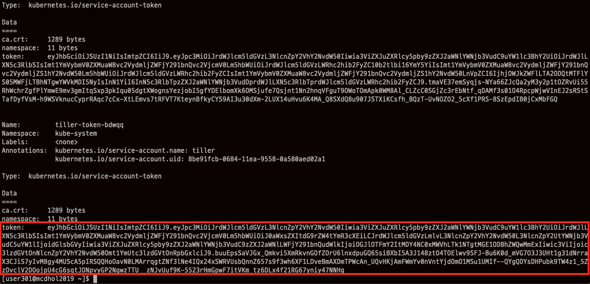
    위에서 token: 다음 부분부터 복사를 해두고, 다음 화면에서 Token을 선택한 후 붙여 넣기를 합니다. 이제 로그인 버튼을 누릅니다.
    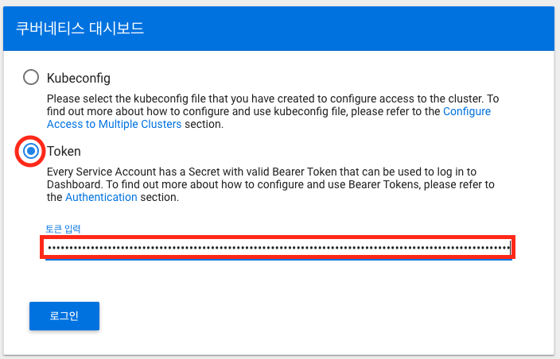

1. 이제 정상적으로 로그인이 되었습니다.
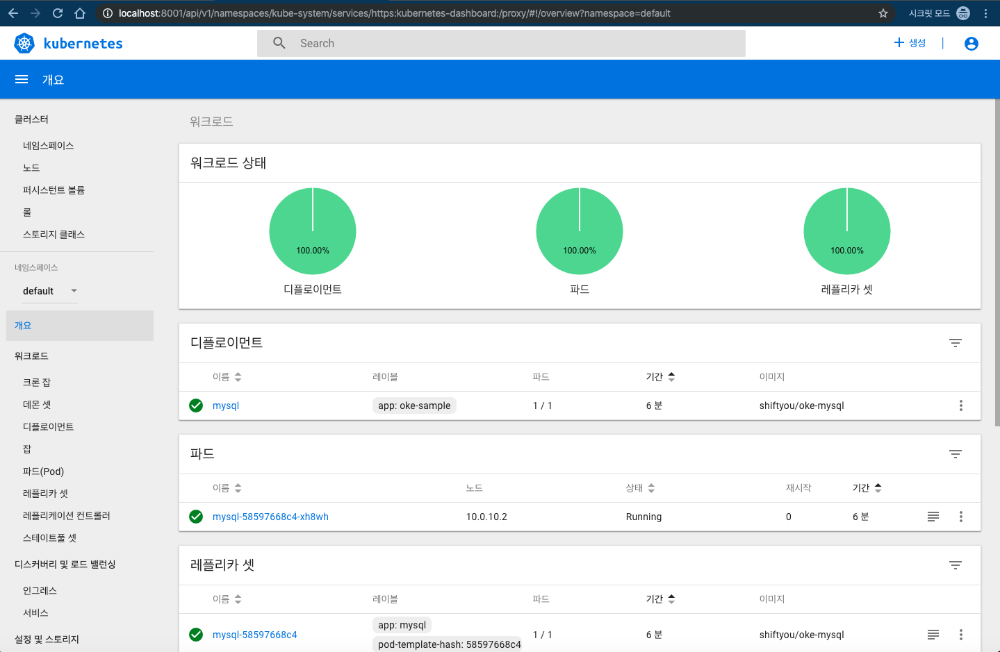
왼쪽 메뉴에서 노드 와 서비스를 눌러 보면 위에서 명령어로 입력한 정보와 동일한 것을 확인하실 수 있습니다.

이번 Lab을 모두 마치셨습니다.

----
다음 Lab 으로 이동  
[2. Developer Cloud Service 에 접속하기](./devcs.md)